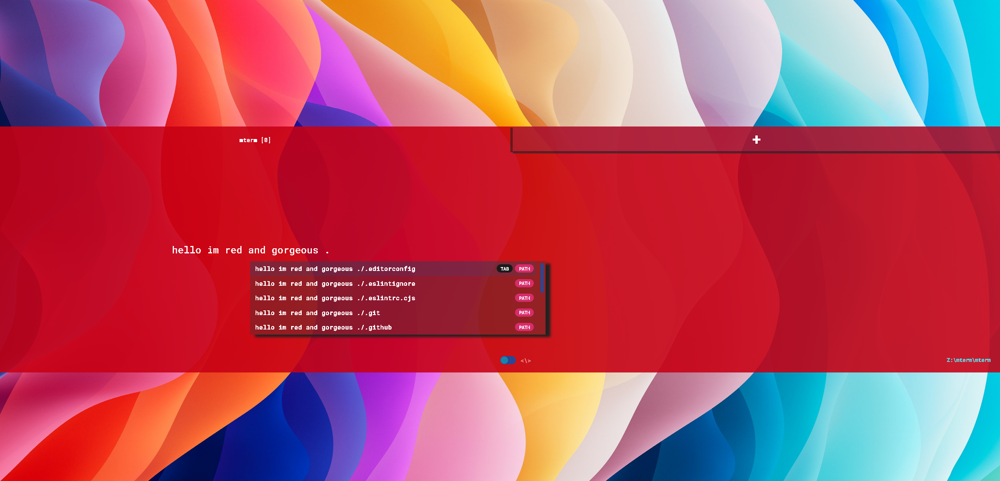

## mterm-ext-red

Make your terminal (mterm) red 10 seconds.

### Install

From within [mterm](https://github.com/mterm-io/mterm)
```bash
ext add mterm-red
```

Presto - your terminal is red -



### Uninstall

From within [mterm](https://github.com/mterm-io/mterm)
```bash
ext rm mterm-red
```

### License

MIT

